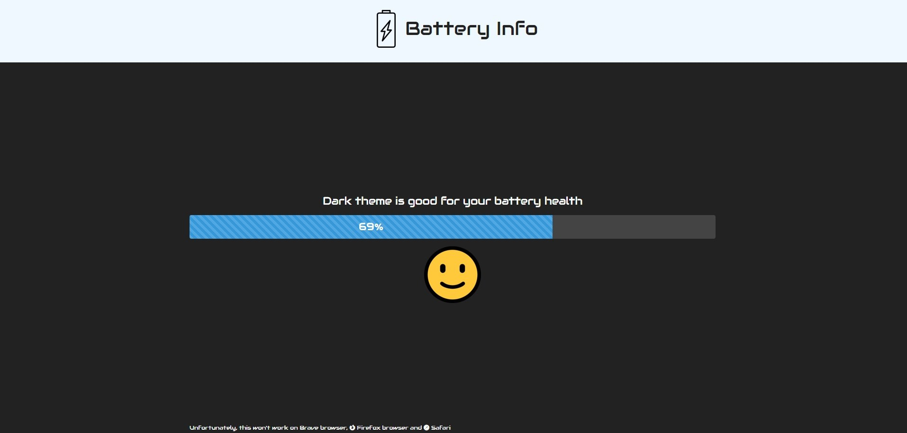

# battery-info-javascript

I built a simple battery info app in vanilla JavaScript using the battery web api in the navigator and Bootstrap.

It will show you the current battery status of your device with some cool and tasty emojis 😏. And charging if it is charging.

Font used in the project: [Audiowide](https://fonts.google.com/specimen/Audiowide).

Bootstrap Theme used: [Darkly on Bootswatch](https://bootswatch.com/darkly/).

